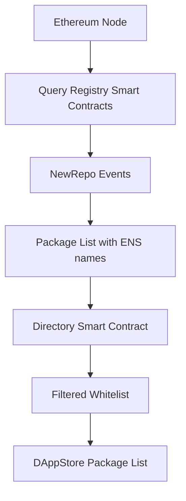
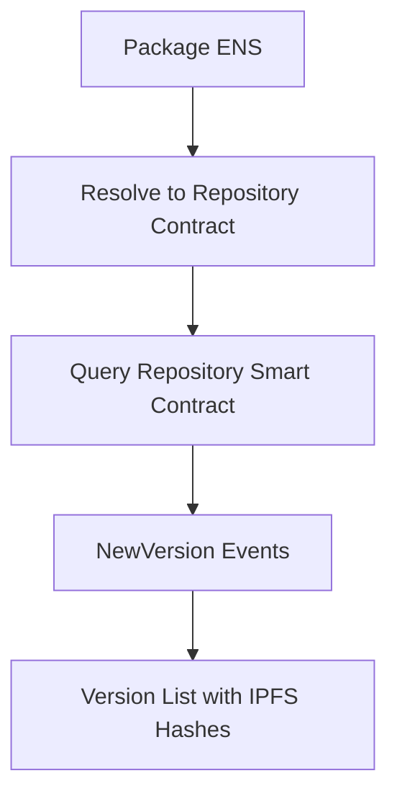
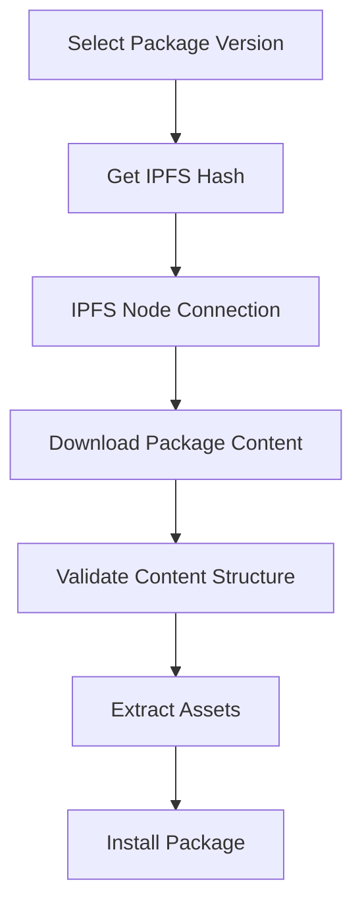

# DAppNode Repository Management System

DAppNode's repository management system is a decentralized package management infrastructure that leverages Ethereum smart contracts and IPFS for package discovery, versioning, and distribution. This document explains how the system works and the key components involved.

## Architecture Overview

The DAppNode repository management system consists of three main smart contract components working together:

1. **Directory** - Manages the whitelist of packages available in the DAppStore
2. **Registry** - Manages ENS domains and package registration for different registries
3. **Repository** - Manages versioning and IPFS content hashes for individual packages

## Core Components

### 1. Directory Smart Contract

The Directory serves as the **whitelist** and catalog system for DAppNode packages.

**Purpose:**
- Defines which packages are available in the DAppStore
- Controls package positioning and display order
- Manages "featured" package status
- Works with both `dnp.dappnode.eth` and `public.dappnode.eth` registries

**Key Features:**
- Whitelist management for package visibility
- Featured package indexing
- Package ordering and categorization

**Implementation:** Located in `packages/toolkit/src/directory/`

### 2. Registry Smart Contracts

DAppNode operates **two separate registries**, each serving different purposes:

#### `.dnp.dappnode.eth` Registry
- **Control:** Managed primarily by DAppNode organization
- **Purpose:** Official DAppNode packages and core infrastructure
- **Smart Contract Address:** `0x266bfdb2124a68beb6769dc887bd655f78778923`
- **ENS:** `dnp.dappnode.eth`

#### `.public.dappnode.eth` Registry  
- **Control:** Public registry - accessible to anyone
- **Purpose:** Community-contributed packages
- **Smart Contract Address:** `0x9f85ae5aefe4a3eff39d9a44212aae21dd15079a`
- **ENS:** `public.dappnode.eth`

**Registry Functions:**
- Package ENS domain registration
- `NewRepo` event emission for package discovery
- Package ownership management
- Integration with TheGraph for efficient querying

**Implementation:** Located in `packages/toolkit/src/registry/`

### 3. Repository Smart Contracts

Each DAppNode package has its **own Repository smart contract** that manages versions and content.

**Key Responsibilities:**
- **Versioning:** Semantic versioning (semver) support
- **Content Storage:** IPFS hash management for each version
- **Event Emission:** `NewVersion` events when packages are updated
- **Version Retrieval:** Get latest, specific, or all versions

**Smart Contract Functions:**
- `getLatest()` - Get the latest version and IPFS hash
- `getBySemanticVersion()` - Get specific version by semver
- `newVersion()` - Publish new version with IPFS hash
- `getVersionsCount()` - Get total number of versions

**Implementation:** Located in `packages/toolkit/src/repository/`

## Package Discovery and Distribution Flow

### 1. Package Discovery

**Process:**
1. **Ethereum Connection Required:** DAppNode needs an Ethereum node to discover packages
2. **Registry Querying:** Query both `.dnp.dappnode.eth` and `.public.dappnode.eth` registries
3. **Event Scanning:** Look for `NewRepo` events to find new packages
4. **TheGraph Integration:** Use TheGraph for efficient event querying
5. **Directory Filtering:** Check Directory smart contract for whitelisted packages
6. **Package Listing:** Display available packages in DAppStore

### 2. Version Discovery

**Process:**
1. **ENS Resolution:** Resolve package ENS to Repository smart contract address
2. **Version Events:** Scan for `NewVersion` events from the Repository contract
3. **IPFS Hash Retrieval:** Each version contains an IPFS hash pointing to package content
4. **Version Validation:** Validate semantic versioning format

### 3. Package Content Download

**Content Structure:**
Each IPFS hash contains a standardized package structure:
- **Manifest** (`dappnode_package.json`) - Package metadata
- **Docker Compose** (`docker-compose.yml`) - Container orchestration
- **Docker Image** - Containerized application
- **Setup Wizard** (optional) - Configuration interface
- **Notifications** (optional) - User alerts and messages
- **Getting Started** (optional) - Documentation
- **Grafana Dashboards** (optional) - Monitoring dashboards
- **Prometheus Targets** (optional) - Metrics configuration

## Key Modules

### Toolkit Module (`packages/toolkit/`)

The **central module** for interacting with smart contracts and IPFS.

**Key Classes:**
- `DappNodeRegistry` - Registry smart contract interaction
- `DappnodeRepository` - Repository smart contract interaction with IPFS
- `ApmRepository` - Base APM (Aragon Package Manager) functionality

**Features:**
- TheGraph integration for efficient querying
- IPFS content validation with DAG verification
- Multiple IPFS gateway support
- Typed smart contract interactions with TypeChain

### Installer Module (`packages/installer/`)

**Extends** `DappnodeRepository` to provide package installation capabilities.

**Key Class:**
- `DappnodeInstaller` - Complete package installation workflow

**Features:**
- Package content validation (manifest, compose, schemas)
- Dependency resolution with `dappGet`
- Docker Compose processing
- Metadata integration
- Multi-architecture support

## Integration Points

### Ethereum Node Dependency

**Required for:**
- Smart contract interactions
- Event querying and scanning
- ENS resolution
- Package and version discovery

**Configuration:** Ethereum node URL configurable in `packages/params/src/params.ts`

### IPFS Node Dependency

**Required for:**
- Package content download
- Content validation and verification
- Asset extraction

**Features:**
- Multiple IPFS gateway support
- DAG-based content verification
- Fallback gateway mechanisms

### TheGraph Integration

**Purpose:** Efficient blockchain event querying

**Subgraphs:**
- DNP Registry subgraph - for `dnp.dappnode.eth` packages
- Public Registry subgraph - for `public.dappnode.eth` packages

**Benefits:**
- Faster package discovery
- Reduced Ethereum node load
- Structured event data

## Security and Trust

### Content Verification

- **IPFS DAG Verification:** Ensures content integrity
- **Schema Validation:** Validates manifest and compose files
- **Trusted Keys:** Support for trusted release keys
- **ENS Security:** Leverages Ethereum's ENS security model

### Package Trust Model

- **Registry Control:** `.dnp` registry controlled by DAppNode
- **Public Registry:** Community packages in `.public` registry
- **Directory Whitelist:** Additional layer of package approval
- **Content Hashing:** Immutable IPFS content addressing

## Development and Testing

### Testing Infrastructure

The toolkit provides comprehensive tests for:
- **Registry Integration:** TheGraph querying and event processing
- **Directory Integration:** Smart contract interaction
- **Repository Integration:** Version and content retrieval
- **IPFS Integration:** Content download and verification

### Development Tools

- **TypeChain:** Typed smart contract interfaces
- **Truffle Integration:** Smart contract compilation
- **Mock Backends:** Development and testing support

## Configuration

### Key Parameters

Located in `packages/params/src/params.ts`:
- Ethereum node URLs
- IPFS gateway URLs
- Registry smart contract addresses
- TheGraph endpoint URLs

### Environment Variables

- `ETHEREUM_URL` - Ethereum node connection
- `IPFS_URL` - IPFS node connection
- Custom gateway configurations

## Error Handling

### Common Issues

1. **Ethereum Node Unavailable:** Package discovery fails
2. **IPFS Node Unavailable:** Package download fails
3. **Invalid Package Structure:** Installation validation errors
4. **Network Connectivity:** Gateway fallback mechanisms
5. **Smart Contract Changes:** ABI compatibility issues

### Resilience Features

- Multiple IPFS gateway support
- Retry mechanisms for network operations
- Graceful degradation when services unavailable
- Comprehensive error reporting and logging

## Future Considerations

### Planned Improvements

- Enhanced content verification mechanisms
- Additional registry support
- Improved caching strategies
- Performance optimizations for large package catalogs

### Scalability

- TheGraph integration reduces blockchain load
- IPFS provides distributed content delivery
- Registry separation allows for different governance models
- Modular architecture supports additional features

---

This document provides a comprehensive overview of DAppNode's repository management system. For implementation details, refer to the source code in `packages/toolkit/` and `packages/installer/`.